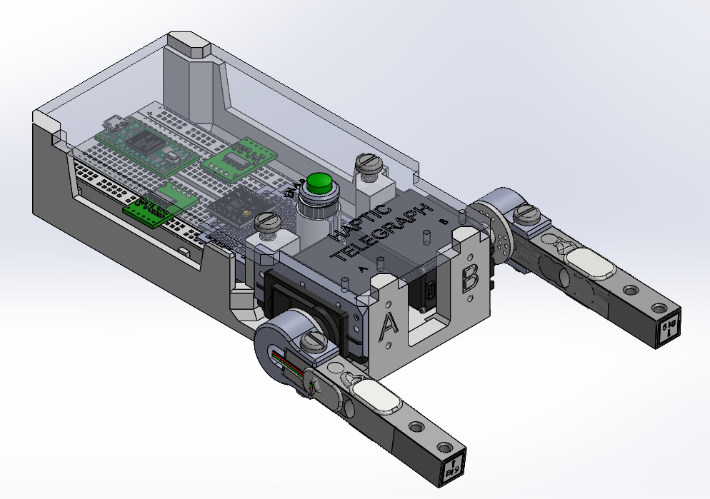
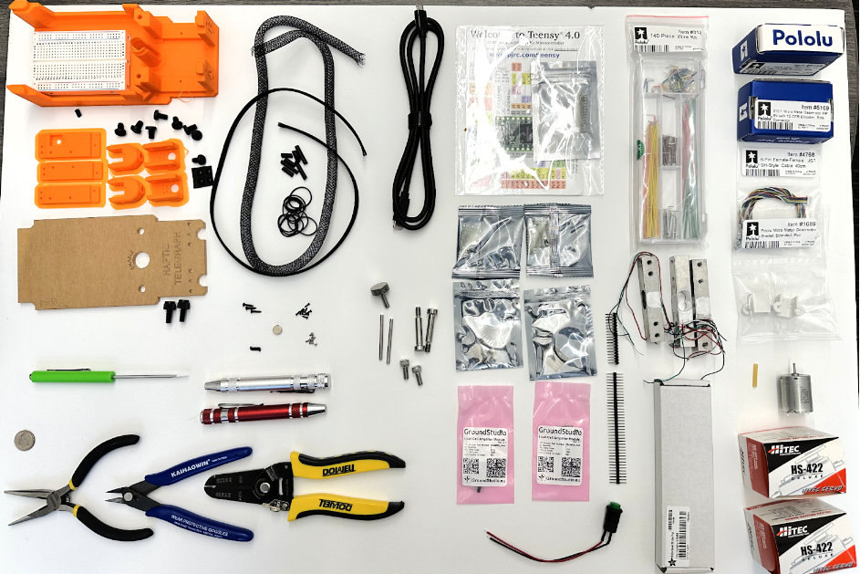
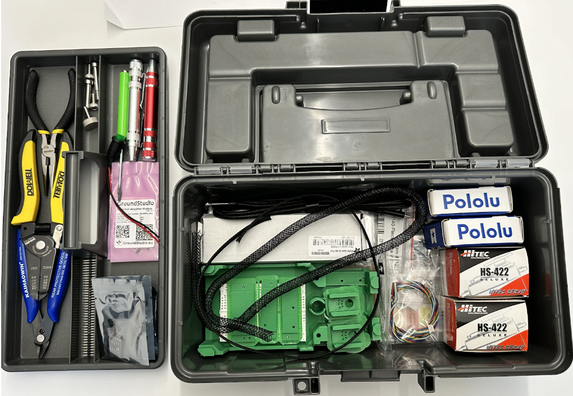

# HapticTelegraph

The Haptic Telegraph is an open-source educational project to learn the basics of mechatronic sensing and control of motion, force, and impedance for one or more degrees or freedom along with basi teleoperation.  Inspired by the [HapKit](https://hapkit.stanford.edu/) open source Haptics learning project, the the haptic telegraph has two degrees of freedom (DOF) with the option to teleoperate over the internet and interconnect different haptic telegraphs to experiment with bilateral teleoperation.  

The platform uses a Teensy 4.0 microcontroller and breadboard to allow prototyping and easier modifications.  Sensing includes potentiometers, encoders, and load cells (HX711); actuators include hobby servos, N20 gearmotors, and direct-drive DC motors; an DRV8833 H-Bridge for driving up to two DC motors, and a simple way of attaching actuators in various configurations.  This includes side-by-side configurations or serlial linkages like a 2-link revolute joint robot with integrated torque sensing. 

## Building and Assembly 
All parts required for the different configurations of the telegrpaph are linked here.  The kit has hobby servo motors, N20 gear motor+encoders, direct drive DC motor for capstan, or DC motorized slide-potentiometer actuators.  The servo and N20 configurations are the default.  

[Haptic Telegraph Assembly Guide](https://docs.google.com/document/d/17Dt6qZLQLV2zLom0jG1yqs2Jcs7Xk3iRWMrtn3mGbbk/preview)

[BOM and Kit Inventory](https://docs.google.com/spreadsheets/d/1TIM3guZMqlwLRaXGF0uH3Ged3IqBKqTgrUTtAIh1ZG8/preview)

## Software and Firmware
A brief introduction to the python scripts to teleoperate the kit and to run the firmware can be found here:  
[Haptic Telegraph Software Guide](https://docs.google.com/document/d/1zL3_G8BJS4lk9wN5zXE0Af6u3FeUNIUszWQ2UWdJn5c/preview)

## Resources
A great intro to haptics, teleoperation, and related terminology can be found here:
[Do It Yourself Haptics: Part I](https://ieeexplore.ieee.org/document/4437756)    
V. Hayward and K. E. Maclean, "Do it yourself haptics: part I," in IEEE Robotics & Automation Magazine, vol. 14, no. 4, pp. 88-104, Dec. 2007, doi: 10.1109/M-RA.2007.90792

A widely acclaimed, more thorough treatment from Prof. Allison Okamura is here:
https://web.stanford.edu/class/me327/

### Info
ME8284 Intermediate Robotics with Medical Applications Graduate Level Course  
University of Minnesota Mechanical Engineering, Fall 2024  
Prof. Timothy M. Kowalewski, timk@umn.edu
Pin-Hao Cheng, cheng741@umn.edu

